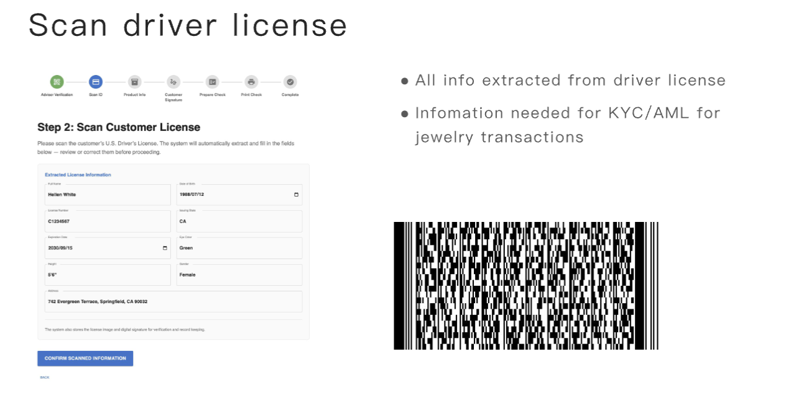
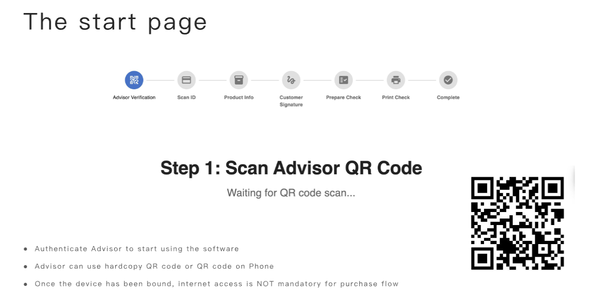
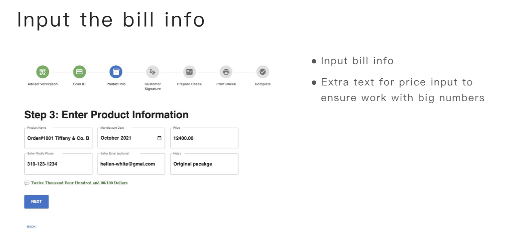
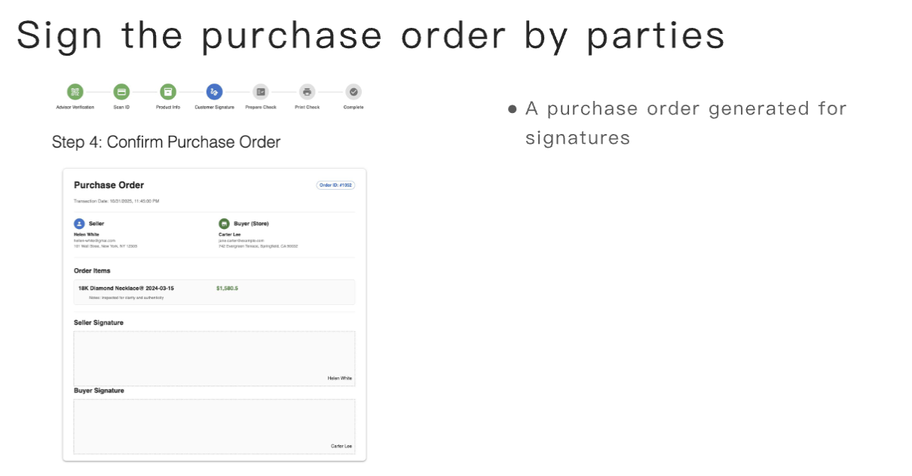
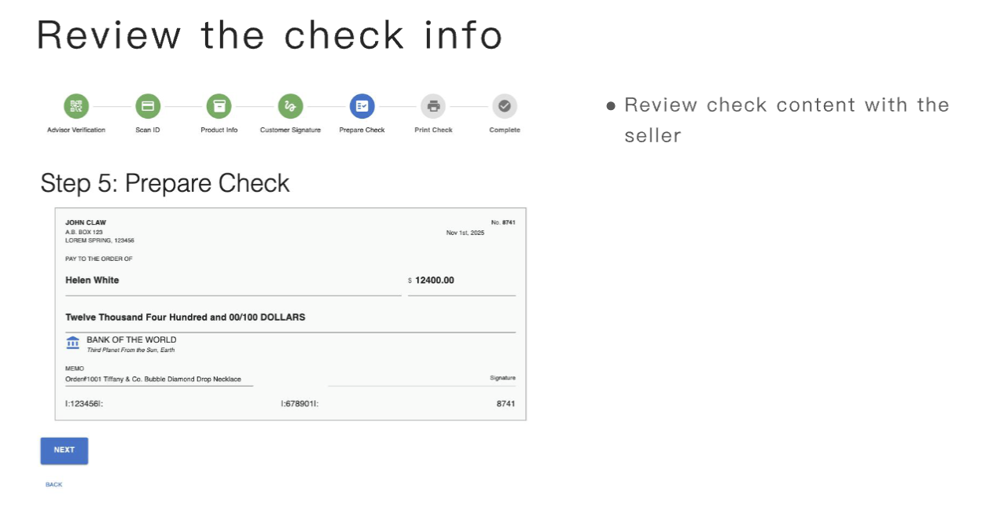
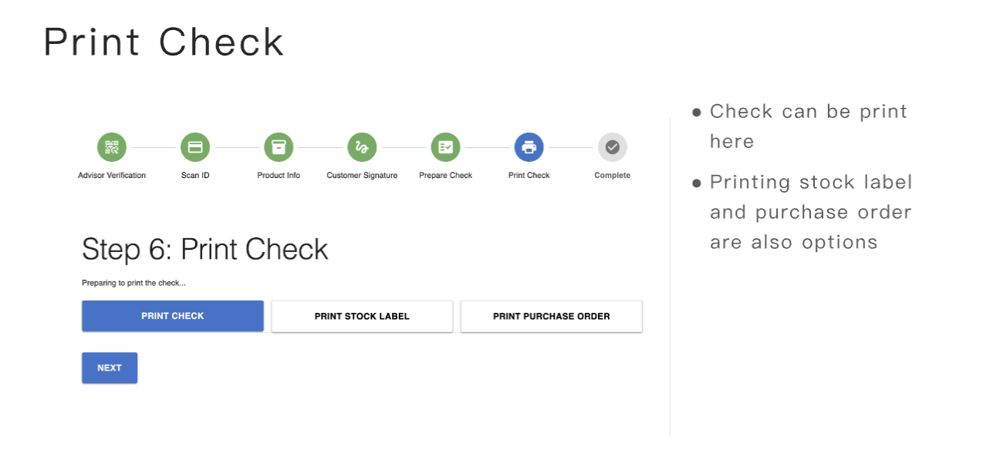
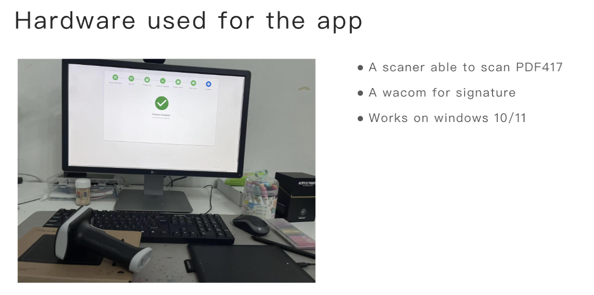
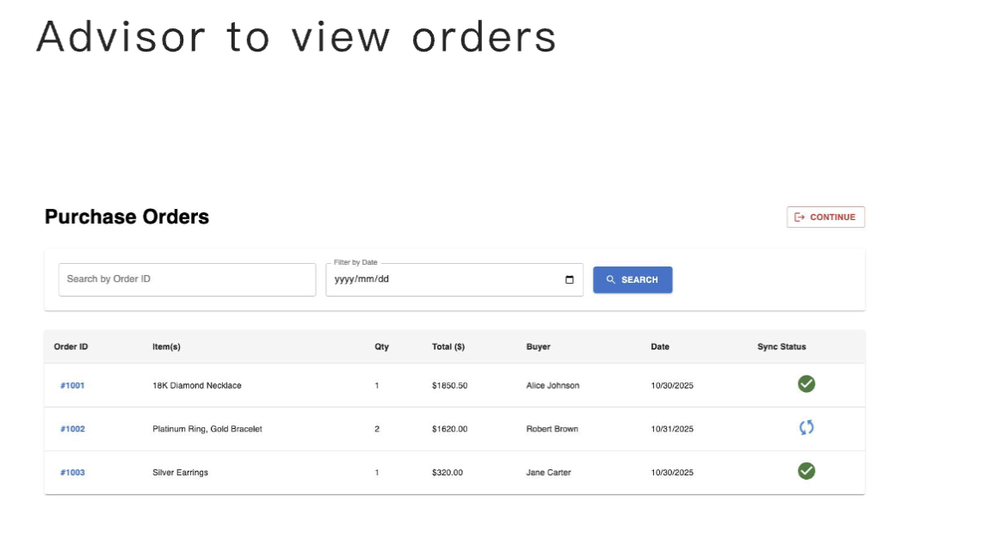
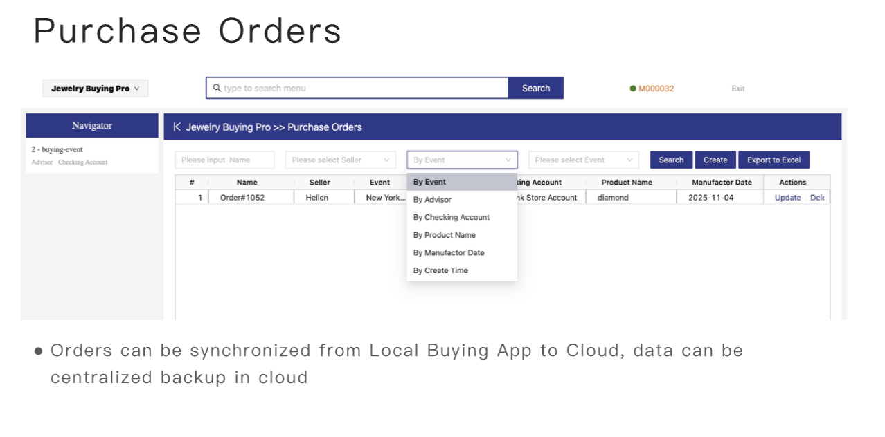

## Jewelry Flow Pro


Jewelry Flow Pro is the in-person buying stack our teams deploy at high-volume
events. It replaces clipboards and ad‑hoc spreadsheets with a guided purchase
flow that stays online or offline, ties every transaction to compliance
artifacts, and gets the payout check printed before the seller leaves the
table.



[Full Guide](./buying-software-proposal.pdf)

---

## Outcomes We Promise

- Intake is consistent even when temps rotate through the event.
- Compliance packets (ID scan, bill of sale, check stub) stay linked per order.
- Checks are printed and logged from the same flow that captured the deal.
- Laptop restarts, flaky Wi-Fi, or printer swaps do not break the workflow.

---

## Core Capabilities

1. **Driver’s license scanning & auto-fill**
   - Reads PDF417 codes on US driver’s licenses.
   - Auto-populates purchase orders with name, address, DOB, and ID number.

2. **Digital signature capture**
   - Captures signatures on Topaz, Wacom, or similar pads.
   - Embeds signatures directly into the generated Bill of Sale PDF.

3. **Check printing integration**
   - Outputs MICR-ready checks via Checkeeper, VersaCheck, or a local printer.
   - Re-uses seller data and payout amounts from the active purchase order.

4. **Document output & retention**
   - Stores signed Bills of Sale and check stubs for bookkeeping.
   - Offers print/email copies for the seller before they exit.

---

## Typical Event Flow

1. Scan the seller’s driver’s license to pre-fill the transaction form.
2. Enter purchased items, pricing, and payout details.
3. Capture the seller’s signature on the Bill of Sale.
4. Print the check and optionally email/print the documents for the seller.
5. Archive the transaction artifacts for accounting and compliance.

---

## Integration Targets

- Hardware: PDF417-compatible ID scanners, Topaz/Wacom signature pads,
  MICR-enabled check printers.
- Software: Checkeeper, VersaCheck, or any local check-printing service that
  accepts MICR data.

---


### Current Features

```
● Clean Purchase Flow
● Process Core flow without internet
● Adviser can scan their credential card (QR Code) to ensure not leaking pass code
● Recovering the flow after laptop restart/power adaptor
● Adviser can select fields to print check on blank paper or a check stock
● Running on web to ensure fluent upgrade
● Sync to cloud to ensure data will not loss
● Works on windows laptop
```

### Roles

```
● Advisor/Buyer： the persons buys advisor who purchase jewelry from another person
● Seller: the person who sell jewelry to advisor/store
```

## Local Buying App


### The start page

```
● Authenticate Advisor to start using the software
● Advisor can use hardcopy QR code or QR code on Phone
● Once the device has been bound, internet access is NOT mandatory for purchase flow
```




### Once Authenticated

```
● Advisor can start a purchasing process or managing orders or going to setting
```


### Scan driver license

```
● All info extracted from driver license
● Infomation needed for KYC/AML for jewelry transactions
```


### Input the bill info

```
● Input bill info
● Extra text for price input to ensure work with big numbers
```



### Sign the purchase order by parties

```
● A purchase order generated for signatures
```




### Review the check info

```
● Review check content with the seller
```



### Print Check

```
● Check can be print here
● Printing stock label and purchase order are also options
```




### Complete the order

```
● A clear sign that the order has been done
```


### Hardware used for the app

```
● A scaner able to scan PDF 417
● A wacom for signature
● Works on windows 10 / 11
```




### Advisor to view orders





## Buying Pro Cloud


### Login to cloud part


### Manage Advisors

```
● Advisor can download a QR code as credential for events
```

### Setup checking account for payment

```
● Admin can set up mutiple checking account for different events
● Create events here can track more data about the events
● Private Seller can be tracked after the transaction done
```


### Purchase Orders

```
● Orders can be synchronized from Local Buying App to Cloud, data can be
centralized backup in cloud

●  This system is centrally managed; route feature requests through the internal product queue so we can coordinate deployments and support.
```




## Contact

If you are considering buy the software, please contact to **zhangxilai#doublechaintech.com** (replace # to @)

